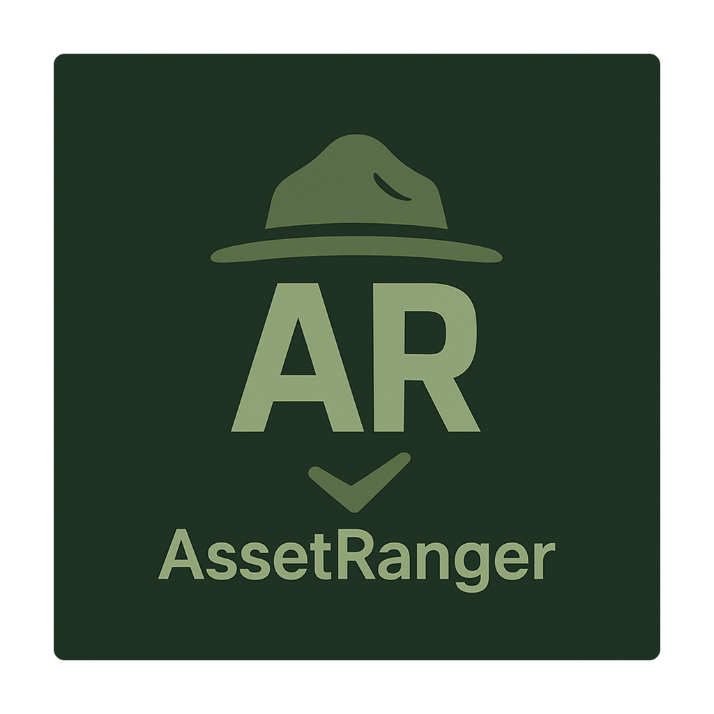

# Welcome to AssetRanger

AssetRanger is a comprehensive mobile asset management application that streamlines equipment tracking through intuitive check-in and check-out workflows.

## Key Features

- **Barcode Scanning** - Quick asset identification with multi-scan batch processing
- **Offline-First Operation** - Works without internet connectivity using local SQLite database
- **Location Tracking** - Optional GPS tagging for asset location history
- **Digital Approvals** - PDF generation with signature capture for equipment transfers
- **Data Import/Export** - CSV and JSON support with validation and round-trip compatibility
- **Audit Trail** - Complete lifecycle tracking with barcode-based persistence
- **Cross-Platform** - Native iOS and Android apps built with React Native and Expo

## Built With Modern Technology

AssetRanger leverages React Native 0.79.5, Expo 53.0.19, and SQLite for a robust, scalable architecture that prioritizes user experience and data integrity.

## Explore the Documentation

- **[Screenshots](screenshots.md)** - Visual tour of the application interface
- **[Architecture](architecture.md)** - Detailed technical overview and design decisions
- **[Privacy Policy](privacy.md)** - Complete data handling and privacy practices

---

[Home](index.md) | [Screenshots](screenshots.md) | [Architecture](architecture.md) | [Privacy](privacy.md)

## Contact Us

For questions about AssetRanger, technical support, or partnership inquiries:
**caesiusbay@gmail.com**

© 2025 AssetRanger. All rights reserved.
