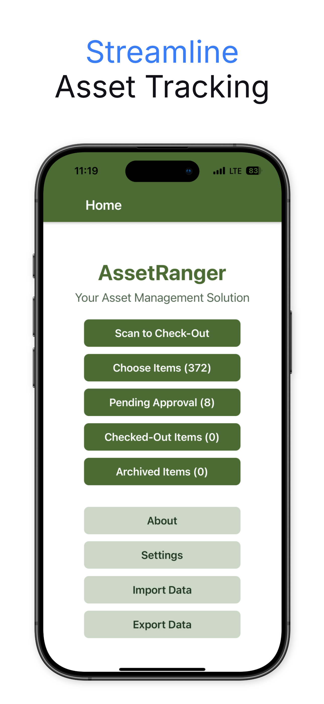
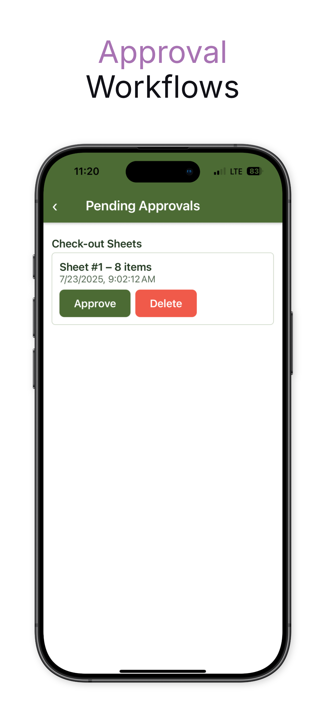
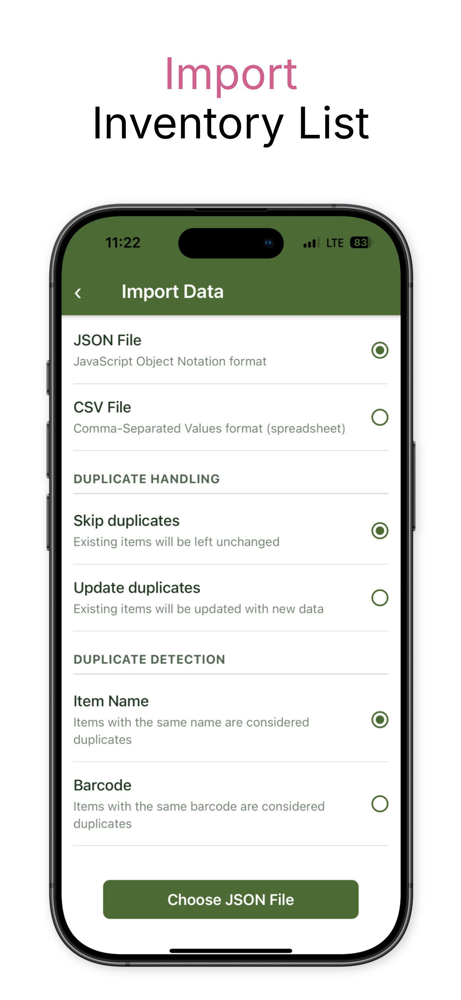
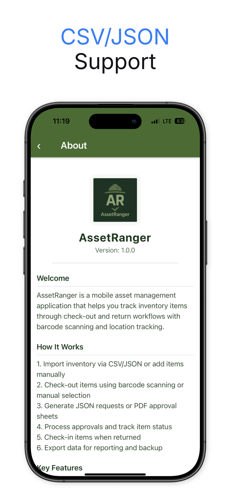
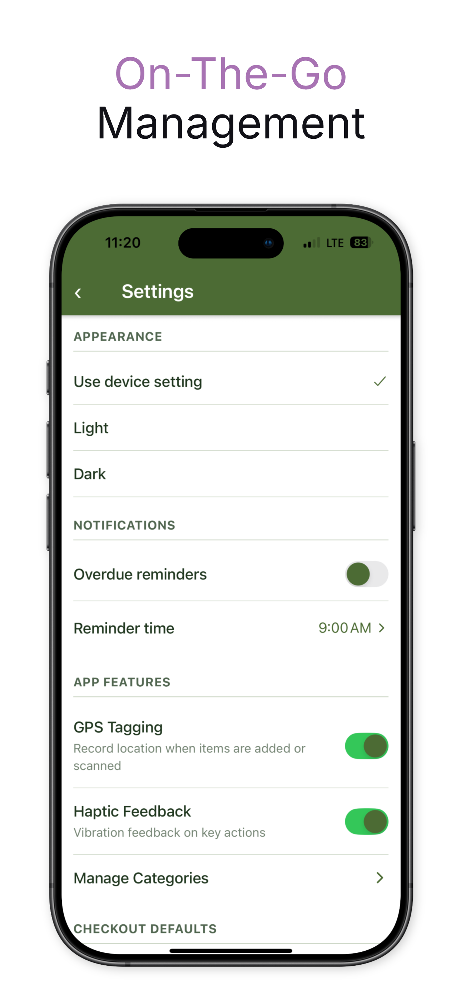

# AssetRanger Screenshots

**Last Updated: August 14, 2025**

Explore AssetRanger's intuitive interface through these screenshots showcasing key features and workflows.

    

## Detailed screenshots coming soon...
---
## Home Screen & Navigation
<!-- Add home screenshot here -->
*Main dashboard with navigation options and inventory overview*

## Item Management
<!-- Add item list screenshot here -->
*Browse and manage your inventory items*

<!-- Add add/edit item screenshot here -->
*Add new items or edit existing asset details*

## Barcode Scanning
<!-- Add barcode scanner screenshot here -->
*Quick asset identification with camera-based barcode scanning*

<!-- Add multi-scan screenshot here -->
*Batch processing with multi-scan functionality*

## Check-Out Workflow
<!-- Add checkout request screenshot here -->
*Create equipment checkout requests*

<!-- Add pending approvals screenshot here -->
*Review and manage pending approval requests*

## Check-In Process
<!-- Add check-in screen screenshot here -->
*Process equipment returns and check-ins*

## Location & Tracking
<!-- Add item detail with location screenshot here -->
*View item details with location history and activity log*

## Data Management
<!-- Add import screen screenshot here -->
*Import inventory data from CSV or JSON files*

<!-- Add export options screenshot here -->
*Export data for backup and reporting*

## Settings & Configuration
<!-- Add settings screen screenshot here -->
*Configure app preferences and default values*

<!-- Add theme toggle screenshot here -->
*Light and dark theme support*

---

[Home](index.md) | [Screenshots](screenshots.md) | [Architecture](architecture.md) | [Privacy](privacy.md)
